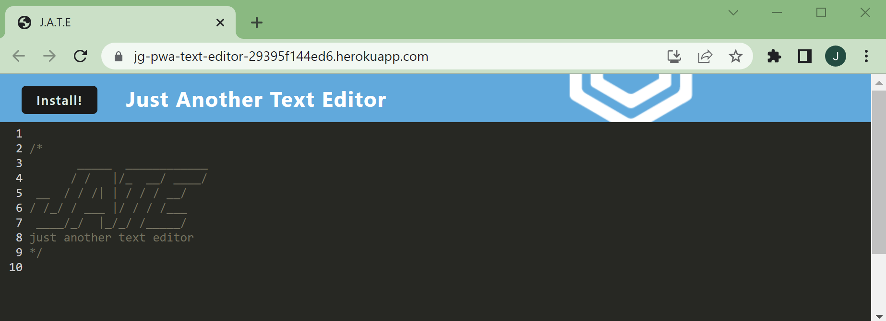
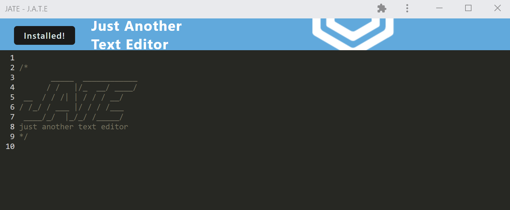

# Just Another Text Editor (JATE)

## Description

 

This application provides a text editor that runs in the browser and saves the content to IndexDB. It's also a Progressive Web Application, allowing you to install it locally.

## Usage

Try it out!
[JATE](https://jg-pwa-text-editor-29395f144ed6.herokuapp.com/)

Notes are only saved once the focus changes from the editor body. Feel free to refresh the browser or close and reopen the app to see that your notes persist!

